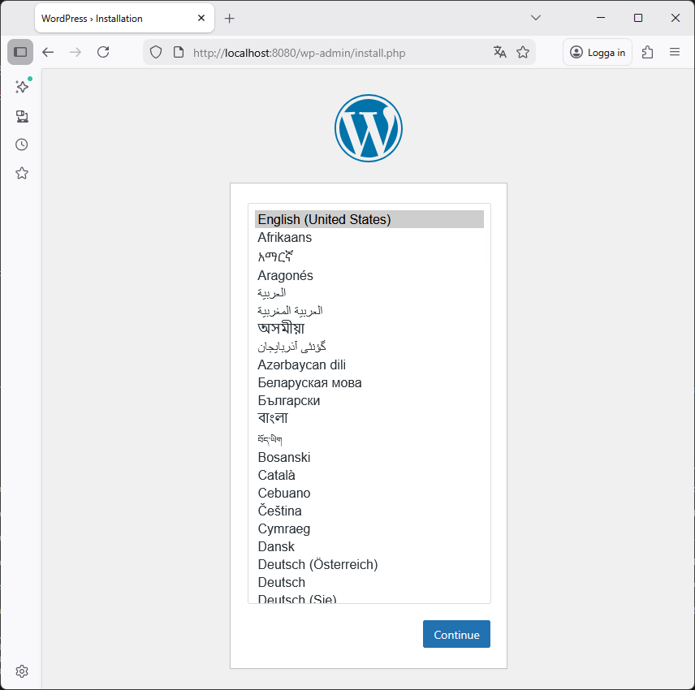
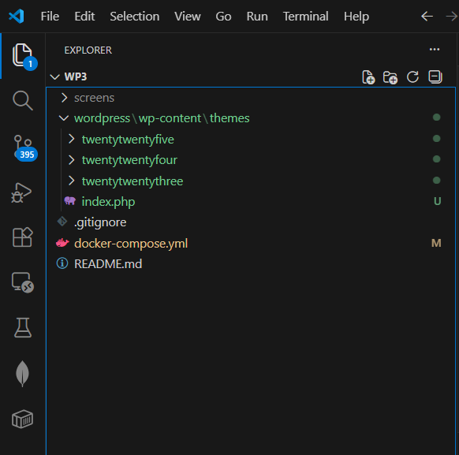
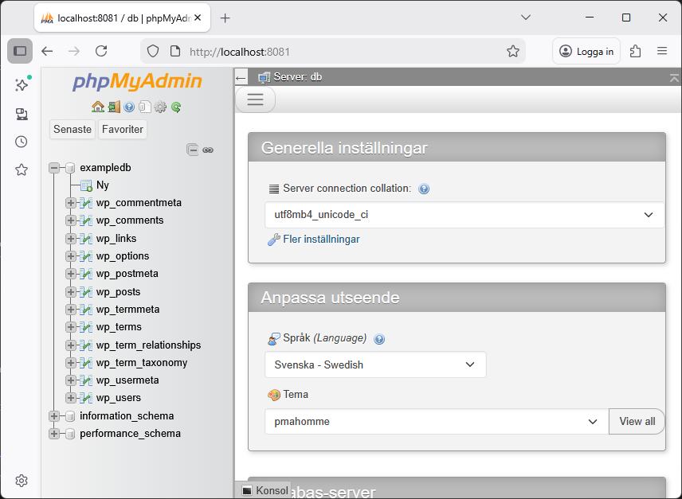
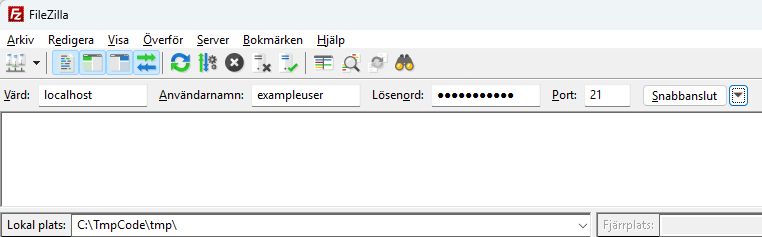
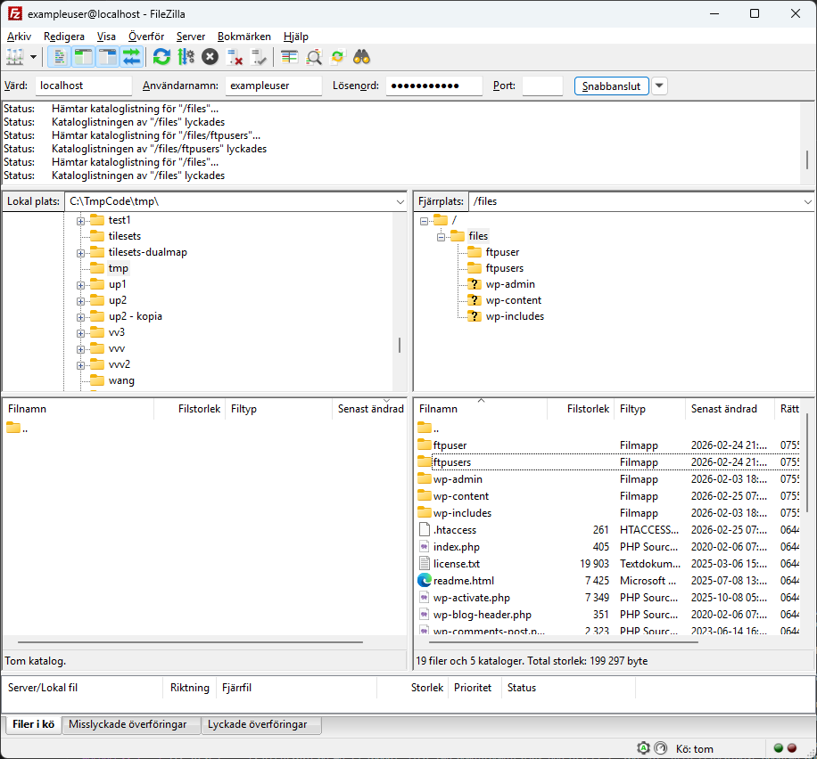

# Docker Wordpress 

This repository provides a Docker setup for quickly spinning up a local WordPress development environment with phpMyAdmin for database management and FTP support for file transfers.

[Docker official Wordpress image](https://hub.docker.com/_/wordpress)


## Get started - build and run container

[Download Docker Desktop](https://www.docker.com/products/docker-desktop/) and ensure it's installed and running.

1. Clone this repo: https://github.com/andsju/Docker-Wordpress-Theme.git
2. Open VS Code terminal and run command `docker-compose up`

In terminal you should see something like

```bash
[+] Running 10/14
 - wordpress Pulling...   
 - phpmyadmin Pulling...  
 - ftp Pulling...
 - ...
```

3. Wait for installation finished and the container is ready for cennections.


------------------------------------------------------------------------------------------

## Browse Wordpress site

Visit http://localhost:8080


The first time you spin up the container you are able to install Wordpress from scratch. Follow instructions. This will create a database record and it will be saved since Docker container has this settings in a volume folder (delete volume and you are ready to install from scratch again).





### Wordpress themes folder

Themes in WordPress are customizable templates that control the visual appearance and layout of your WordPress site. 

`wordpress/wp-content/themes/`

Default theme name **underscores-me** generated from https://underscores.me/ 


#### Wordpress Themes folder in VSCode


Volumes settings in docker-compose.yml are:

```yaml
    volumes:
      - ./wordpress/wp-content/themes:/var/www/html/wp-content/themes
```

This setting display volumne folder structure in VS Code explorer. 




It´s possible to display all container files in VS Code **(slowing down performance)** if volumes settings instead are:

```yaml
    volumes:
      - ./wordpress:/var/www/html
```


## Stop container 

Terminate and stop container using terminal cmd `ctrl-c`

Docker command to remove container: `docker-compose down`


------------------------------------------------------------------------------------------


## YAML file docker-compose.yml

File *docker-compose.yml* defines Docker services, networks, and volumes. It enables you to run multiple containers together with a single command, making local development and deployment easier by managing service dependencies and configurations.

**Volumes** in a docker-compose.yml file are used to persist data between container restarts and to share files between the host machine and containers. In this setup, volumes store the WordPress files and the MySQL database, ensuring that your site content and database remain intact even when containers are stopped or recreated.


*docker-compose.yml*

```yml

services:
  wordpress:
    image: wordpress
    restart: always
    ports:
      - 8080:80
    environment:
      WORDPRESS_DB_HOST: db
      WORDPRESS_DB_USER: exampleuser
      WORDPRESS_DB_PASSWORD: examplepass
      WORDPRESS_DB_NAME: exampledb
    volumes:
      - ./wordpress/wp-content/themes:/var/www/html/wp-content/themes
    mem_limit: 512m

  db:
    image: mysql:latest
    restart: always
    environment:
      MYSQL_DATABASE: exampledb
      MYSQL_USER: exampleuser
      MYSQL_PASSWORD: examplepass
      MYSQL_RANDOM_ROOT_PASSWORD: '1'
    volumes:
      - db:/var/lib/mysql
    mem_limit: 512m

  phpmyadmin:
    image: phpmyadmin
    restart: always
    ports:
      - 8081:80
    environment:
      PMA_HOST: db
      PMA_USER: exampleuser
      PMA_PASSWORD: examplepass
  
  ftp:
    image: stilliard/pure-ftpd
    restart: always
    ports:
      - 21:21
      - 30000-30009:30000-30009
    environment:
      PUBLICHOST: localhost
      FTP_USER_NAME: exampleuser
      FTP_USER_PASS: examplepass
      FTP_USER_HOME: /home/examplepass
    volumes:
      - wordpress:/home/examplepass/files
    mem_limit: 256m
    depends_on:
      - wordpress

volumes:
  wordpress:
  db:

```


------------------------------------------------------------------------------------------


## Use phpMyAdmin to browse database

Docker setup installs phpMyAdmin - a free and open-source web-based database management tool that allows you to manage MySQL databases through a graphical interface. 
In this Docker setup, phpMyAdmin is pre-configured to connect to the MySQL container, giving you quick access to your WordPress database without leaving your browser.


Visit http://localhost:8081




------------------------------------------------------------------------------------------

## Use ftp to transfer files 

Docker container includes FTP support for easy file transfers. Use an FTP client like **FileZilla** to connect to the FTP server. Configure your FTP client with:

- **Host:** localhost
- **Port:** 21
- **Username:** <docker-compose.yml settings>
- **Password:** <docker-compose.yml settings>

Then you can browse and transfer files to the WordPress container directly.



Using port 21 raises a secure issue...


In FileZilla, the local environment is displayed on the left side and the server environment is displayed on the right side. This allows you to easily drag and drop files between your local machine and the WordPress container.


